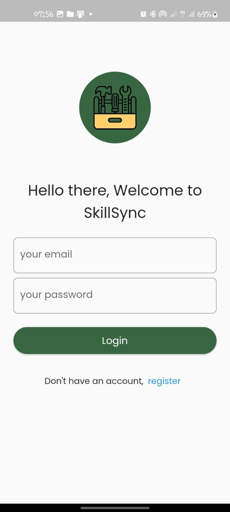
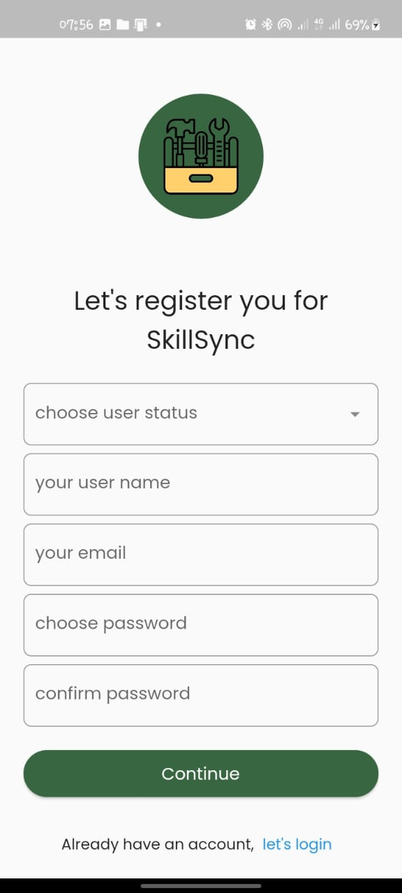
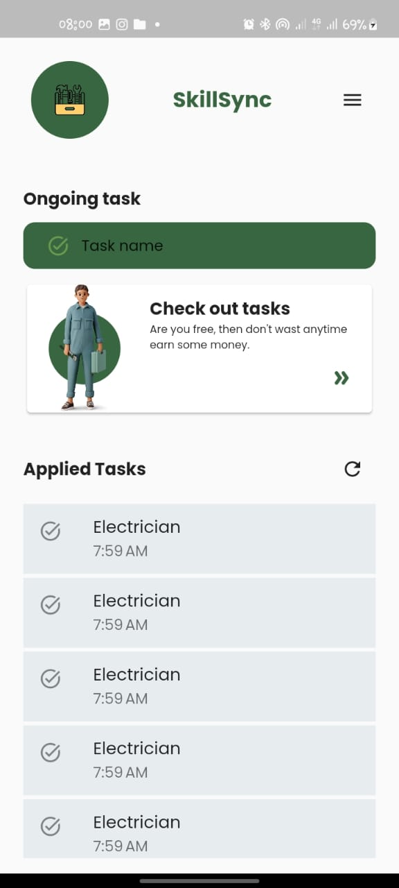
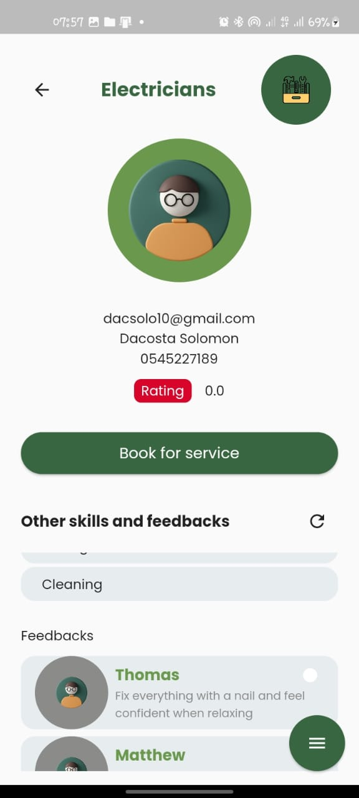

<!-- # Skillsync

## Description

<!-- This is a minimalist application for connecting people with skills to task created by people
who have registered on the application as employers. -->

<!-- This is a minimalist application for connecting people with skills to people who need those skills to work for them.
The people with skills will be employees and those who need those skills, like electrician, plumbing, driving, etc., at their disposal for service are the employers. -->
<!--
**_NOTE:_** Both employers and employees must register with the app before they can use its functionalities.

## Packages used -->
<!--
- get
- shared_preferences -->
<!-- - dropdown_textfield -->
<!-- - intl
- shrink_sidemenu
- provider
- flutter_config
- HTTP -->

<!-- The backend was written using Spring Boot. -->

<!-- ## Software architectures -->

<!-- **MVVC** (Model View View Controller) architecture was used with Flutter to build the front-end.

**MVC** (Model View Controller) architecture was used in Java Spring Boot to build the backend. -->

# Skillsync

## Overview

Skillsync is a user-friendly platform designed to connect skilled individuals with those seeking their expertise for a wide range of tasks and services. This README provides a comprehensive guide to understanding, setting up, and contributing to the Skillsync project.

## Table of Contents

1. [Getting Started](#getting-started)
2. [Features](#features)
3. [Technology Stack](#technology-stack)
4. [Project Structure](#project-structure)
5. [Installation](#installation)
6. [Usage](#usage)
7. [Contributing](#contribution)
8. [License](#license)

## Getting Started

Welcome to Skillsync! This section will guide you through the essential steps to get started with the project.

### Prerequisites

Before you begin, ensure you have met the following requirements:

- [Flutter](https://flutter.dev/) installed for the front-end.
- [Java](https://www.java.com/) and [Spring Boot](https://spring.io/projects/spring-boot) for the back-end.
- A compatible code editor (e.g., [VS Code](https://code.visualstudio.com/), [Android Studio](https://developer.android.com/studio)).

### Clone the Repository

To get started, clone the Skillsync repository to your local machine:

```shell
git clone https://github.com/KPrince-coder/skillsync.git

```

### Front-end and Backend Setup

Navigate to the **`front-end`** and **`backend`** directories and follow the setup instructions provided over there.

### Features

Skillsync offers a range of features designed to simplify the connection between skilled workers and employers:

- User-friendly registration and log in system.
- Seamless integration between the front-end (Flutter) and backend (Spring Boot).
- An intuitive user interface with multiple pages for registration, login, and task creation.

Explore the project to discover more features and functionalities.

### Technology Stack

Skillsync utilizes a powerful technology stack to deliver a robust and efficient platform:

#### Front-end (Flutter, MVVC Architecture)

- Flutter
- `get` package
- `shared-preference` package
- `dropdown-textfield` package
- `intl` package
- `shrink-sidemenu` package
- `provider` package
- `flutter-config` package
- `http` package

#### Backend (Java Spring Boot, MVC Architecture)

- Spring Boot

### Project Structure

The project follows a well organized structure:

- `frontend`: Contains the Flutter-based front-end code.
- `backend`: Houses the Java Spring Boot-based back-end code.
- `frontend/ui_images`: Stores UI image assets.

### Usage

Once installed and configured, you can start using Skillsync by following these simple steps:

1. Register as employer or employee.
2. Log in to access your account.
3. Create tasks or request services.
4. Enjoy the seamless connection with skilled workers.

### Contribution

We welcome contributions to Skillsync! Whether it's bug fixes, feature enhancements, or documentation improvements, your input is valuable. Please follow the instructions below:

1. Fork the repository to your own GitHub account.
2. Clone the repository to your local machine:

   ```shell
   git clone https://github.com/KPrince-coder/skillsync.git
   ```

3. Create a new branch for your project.

   ```shell
   git checkout -b feature/your-feature-name

   ```

4. Make your changes, test thoroughly, and ensure the code meets our coding standards.
5. Commit your changes with a descriptive commit message:

   ```shell
   git commit -m "Add your descriptive commit message here"

   ```

6. Create a Pull Request (PR) from your forked repository to the main Skillsync repository. Be sure to provide a clear description of your changes.

   I will review your contributions and merge them if they meet our quality standards. Thank you for helping improve Skillsync!

### License

Skillsync is open-source software distributed under the [MIT License](LICENSE). You are free to use, modify, and share this software as per the license terms.

### Sample Ui image

- Log in Page



- Register Page



- On-going Task Page



- Worker Page



#### For more UI images, go to [UI_Images](./frontend/ui_images/)
